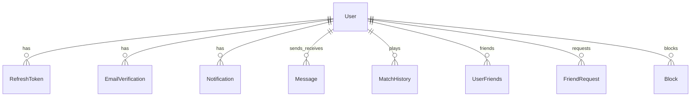

*This project has been created as part of the 42 curriculum by loayy17, OmarIssa0.*

# Arena 404

## Description

**Arena 404** is a real-time multiplayer gaming web application. Players create an account, add friends, chat, and play live matches against other users or an AI opponent.

The product goal is to provide a complete social game arena in the browser: authentication, presence, matchmaking, several distinct games, match history, and notifications — deployed as a single containerized stack over HTTPS.

Key features:

- Email and password registration with hashed passwords, email verification, and password reset
- Real-time games: Tic-Tac-Toe, Ping Pong, Snake, Rock Paper Scissors, and Connect Four
- Remote play, matchmaking, private lobbies, and friend invites
- AI opponent when a second human player is not available
- Friends, blocks, private chat, online / in-game status
- Match history, notifications, and user preferences (language and theme)
- Arabic and English UI with RTL layout for Arabic

## Instructions

### Prerequisites

- Docker and Docker Compose v2
- (Optional, local development) Node.js 22+, .NET 10 SDK, PostgreSQL 16
- A copied environment file (see below)

### Environment

```bash
cp .env.example .env
```

Edit `.env` and set at least:

- `POSTGRES_PASSWORD` — database password
- `JWT__Token` — a secret of at least 32 characters
- `EmailSettings__Password` — Brevo API key if you need verification emails

The `.env` file is ignored by Git. `.env.example` documents every variable without secrets.

### Run with Docker (single command)

```bash
docker compose up --build -d
```

Or:

```bash
make up
```

Wait until `docker compose ps` shows `nginx` as Up, then open **https://localhost:8443**. The reverse proxy uses a self-signed certificate. In Chrome, choose Advanced and proceed to localhost.

The reverse proxy uses a self-signed certificate for `localhost`. In Chrome, choose Advanced and proceed to localhost. Browser-to-server traffic is HTTPS. Traffic inside the Docker network (nginx → Next.js / ASP.NET, ASP.NET → PostgreSQL) is internal HTTP, which the subject allows.

Stop the stack:

```bash
docker compose down
```

### Local development (without Docker)

1. Start PostgreSQL and set `ConnectionStrings__DefaultConnection`, `JWT__Token`, `JWT__Issuer`, and `JWT__Audience` in `backend/.env`.
2. From `backend/`: `dotnet run`
3. From `frontend/`: set `NEXT_PUBLIC_API_URL` to the backend origin, then `npm install` and `npm run dev`
4. Frontend: `http://localhost:3000`

For local development through the same HTTPS proxy as production, use the Docker command above.

## Team Information

| Login | Role(s) | Responsibilities |
| --- | --- | --- |
| loayy17 | Technical Lead / Architect, Developer | Architecture, stack choices, code quality, backend and frontend implementation |
| OmarIssa0 | Product Owner, Developer | Product direction, feature priorities, implementation and review |

Project Manager / Scrum Master duties (planning, sync, blockers) are shared by the team. Update this table with every teammate’s 42 login before evaluation if the group is larger than the two logins listed above.

## Project Management

- Work is split by area: authentication and users, social (friends / chat / notifications), games and SignalR, and UI.
- GitHub is used for the repository, pull requests, and history. Commit messages describe the change.
- The team coordinates over chat (Discord or equivalent) and short syncs when a feature crosses backend and frontend.
- Important behaviour is reviewed in code review before it lands on `main`.

## Technical Stack

- **Frontend:** Next.js (App Router), React, TypeScript, Tailwind CSS, SignalR client
- **Backend:** ASP.NET Core, SignalR hubs (`/gameHub`, `/socialHub`)
- **Database:** PostgreSQL with Entity Framework Core (ORM, migrations)
- **Realtime:** WebSockets via SignalR for games, chat, presence, and notifications
- **Auth:** JWT in HTTP-only Secure cookies, refresh tokens, ASP.NET Identity password hasher
- **Email:** Brevo transactional email for OTP verification and password reset
- **Deployment:** Docker Compose — PostgreSQL, backend, frontend, nginx TLS reverse proxy

Why these choices:

- Next.js and ASP.NET Core are full frameworks with routing, structure, and ecosystems, matching the Web module.
- PostgreSQL fits relational data (users, friends, messages, match history) with a clear schema.
- SignalR gives a single model for WebSocket games and social events.
- nginx terminates HTTPS so the browser never talks to the backend in clear text.

## Database Schema

PostgreSQL tables and relationships:

```
User
  id (uuid, PK)
  user_name (unique)
  email (unique)
  password_hash
  first_name, last_name
  role, status, is_verified
  preferences (json text)
  created_at
  ├── RefreshToken (user_id)     hashed refresh tokens, expiry
  ├── EmailVerification (user_id) hashed OTP, purpose, expiry
  ├── MatchHistory as player1 / player2
  ├── Message as sender / receiver
  ├── Notification
  ├── UserFriends (user_id, friend_id)
  ├── FriendRequest (sender_id, receiver_id, status)
  └── Block (blocker_id, blocked_id)
```

Game rooms (Ping Pong, Tic-Tac-Toe, Snake, Rock Paper Scissors, Connect Four) are in-memory on the game server, not persisted as rooms. Completed matches are written to `MatchHistory`.



## Features List

| Feature | Who | What it does |
| --- | --- | --- |
| Registration, login, logout, refresh | Team | Secure email/password auth with HTTP-only cookies |
| Email verification and password reset | Team | OTP emailed, hashed at rest, time-limited |
| Profile and preferences | Team | Update name/username, password, language, theme |
| Friends, requests, search, block | Team | Add/remove friends, see online status |
| Private chat | Team | Send/receive messages, unread counts, persistence |
| Notifications | Team | Friend events, messages, game invites |
| Games + matchmaking | Team | Five live games, public search, private lobby, invites |
| AI opponent | Team | Start a match against a bot when player 2 is empty |
| Remote play and reconnect | Team | Two browsers, SignalR reconnect, disconnect handling |
| Match history | Team | Wins, losses, draws, opponent, scores, date |
| i18n + RTL | Team | English and Arabic, layout direction switch |
| Privacy Policy and Terms of Service | Team | Public pages with footer links on auth, dashboard, and legal layouts |
| HTTPS deployment | Team | nginx TLS proxy, one-command Docker Compose |

## Modules

Point calculation: Major = 2 pts, Minor = 1 pt. Target: at least 14 pts.

| Module | Type | Pts | How it is implemented | Who |
| --- | --- | --- | --- | --- |
| Framework for frontend and backend | Major | 2 | Next.js + ASP.NET Core | Team |
| Real-time features (WebSockets) | Major | 2 | SignalR game and social hubs, reconnect, broadcast | Team |
| User interaction (chat, profile, friends) | Major | 2 | Chat, friends, profile fields, presence | Team |
| ORM | Minor | 1 | Entity Framework Core + PostgreSQL | Team |
| Web-based game | Major | 2 | Five complete games with win/loss rules | Team |
| Remote players | Major | 2 | Two machines, latency/disconnect handling, reconnect | Team |
| Additional game + matchmaking | Major | 2 | Several extra games beyond the first, `FindMatch` | Team |
| AI opponent | Major | 2 | Bot player (`__BOT__`) with per-game move logic | Team |
| RTL language support | Minor | 1 | Arabic, `dir="rtl"`, mirrored layout | Team |
| Custom design system | Minor | 1 | Reusable `G*` components, palette, typography, icons | Team |

**Subtotal currently claimed: 19 pts** (14 required). Extra modules may be used as bonus after the mandatory 14 are validated.

Modules not claimed yet (planned or incomplete): OAuth, 2FA, tournaments, spectator, game customization, third language, public API with API keys, avatar upload, leaderboard/achievements as a full statistics module.

## Individual Contributions

- **loayy17** — majority of the backend (auth, games, SignalR, social) and frontend structure; technical decisions.
- **OmarIssa0** — additional implementation and integration on the shared codebase.

Each member must be able to explain the full project and their own commits during evaluation. Refine this section with a feature-by-feature split before the defense if more teammates join.

## Resources

- [ASP.NET Core documentation](https://learn.microsoft.com/aspnet/core)
- [SignalR documentation](https://learn.microsoft.com/aspnet/core/signalr)
- [Next.js documentation](https://nextjs.org/docs)
- [Entity Framework Core](https://learn.microsoft.com/ef/core)
- [PostgreSQL](https://www.postgresql.org/docs/)
- [nginx reverse proxy](https://nginx.org/en/docs/http/ngx_http_proxy_module.html)
- [ft_transcendence subject](https://github.com/) — 42 Common Core final project specification (v21.2)

### How AI was used

AI tools were used to speed up repetitive work, not to replace understanding:

- Drafting Docker Compose, nginx TLS, and HTTPS reverse-proxy configuration
- Drafting Privacy Policy and Terms of Service text aligned with the actual product
- Structuring this README to match the subject’s required sections
- Boilerplate and refactor suggestions for TypeScript/C# that the team reviewed, tested, and owns

AI-generated output was checked, edited, and tested by the team. Peers review non-trivial changes. Evaluators may ask any member to explain any part of the stack.

## Known limitations

- The HTTPS certificate is self-signed for local evaluation.
- Email verification requires a valid Brevo API key in `.env`.
- User avatars currently use initials rather than uploaded images.
- All live games are 1v1 (including versus the AI bot).
